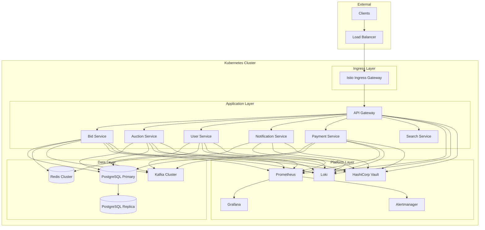
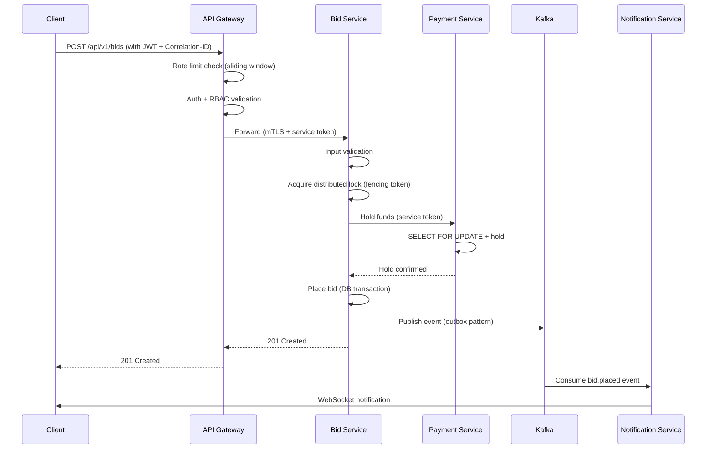
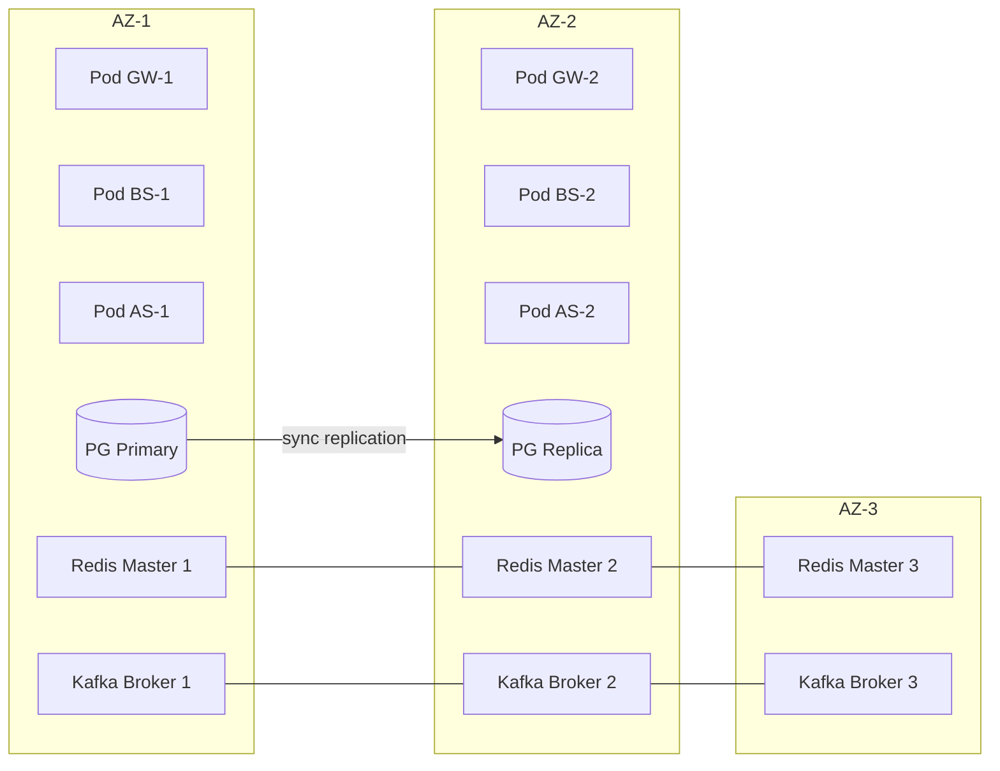

# Design Document: Production Readiness

## Overview

Ushbu dizayn hujjati auction-system microservices loyihasini production-readiness darajasiga olib chiqish uchun texnik yechimlarni belgilaydi. Dizayn 20 ta talabni qamrab oladi: konteyner xavfsizligi, secrets boshqaruvi, distributed locking, circuit breaking, structured logging, alerting, database management, Kafka ishonchliligi, rate limiting, graceful shutdown, input validation, service-to-service auth, test qamrovi, monitoring dashboards, API versioning, resurs boshqaruvi, disaster recovery, tranzaksion yaxlitlik, hujjatlashtirish, va network policies.

### Design Principles

- **Defense in Depth**: Har bir qatlam mustaqil xavfsizlik nazoratiga ega
- **Observability First**: Barcha komponentlar metrikalar, loglar va trace'lar chiqaradi
- **Graceful Degradation**: Dependency nosozligida tizim degraded rejimda ishlaydi
- **Idempotency**: Barcha state-changing operatsiyalar takroriy chaqirilganda xavfsiz
- **Infrastructure as Code**: Barcha konfiguratsiya versiyalangan va avto-deploy

### Technology Stack

| Component | Technology | Rationale |
|-----------|-----------|-----------|
| Language | Go 1.22 | Mavjud stack, concurrency uchun ideal |
| HTTP Framework | Gin | Loyihada allaqachon foydalanilmoqda |
| Logging | Zap (structured JSON) | Mavjud, high-performance |
| Metrics | Prometheus client_golang | Mavjud integratsiya |
| Tracing | OpenTelemetry | Mavjud, vendor-neutral |
| Message Broker | Kafka (Sarama/confluent-kafka-go) | Mavjud infratuzilma |
| Cache/Lock | Redis (go-redis/v9) | Mavjud infratuzilma |
| Database | PostgreSQL (pgx) | Mavjud, ACID compliance |
| Orchestration | Kubernetes + Istio | Mavjud, mTLS uchun |
| Secrets | HashiCorp Vault + SealedSecrets | Requirement 2 |
| CI/CD | GitHub Actions + ArgoCD | Mavjud pipeline |
| Monitoring | Prometheus + Grafana + Alertmanager | Mavjud infratuzilma |

## Architecture

### System Architecture Diagram



### Service Communication Flow



### Deployment Architecture



## Components and Interfaces

### 1. Shared Package (`pkg/`) — Common Libraries

#### `pkg/lock` — Production-Grade Distributed Lock

```go
type LockConfig struct {
    TTL            time.Duration
    RetryCount     int           // default: 3
    RetryBaseDelay time.Duration // default: 50ms
    RetryMultiplier float64      // default: 2.0
    ExtendThreshold float64      // default: 0.8 (80% of TTL)
}

type Lock struct {
    Key          string
    Owner        string
    FencingToken int64
    TTL          time.Duration
    AcquiredAt   time.Time
}

type LockManager interface {
    Acquire(ctx context.Context, key string, cfg LockConfig) (*Lock, error)
    Release(ctx context.Context, lock *Lock) error
    Extend(ctx context.Context, lock *Lock) error
}
```

#### `pkg/circuitbreaker` — Enhanced Circuit Breaker

```go
type Config struct {
    FailureThreshold  int           // 1-100, default: 5
    ResetTimeout      time.Duration // 1s-300s, default: 30s
    SuccessThreshold  int           // 1-10, default: 1
    CacheTTL          time.Duration // default: 60s
}

type State int
const (
    StateClosed   State = 0
    StateOpen     State = 1
    StateHalfOpen State = 2
)

type CircuitBreaker interface {
    Execute(ctx context.Context, fn func() (interface{}, error)) (interface{}, error)
    State() State
    Metrics() Metrics
}

type Metrics struct {
    State             State
    ConsecutiveFails  int
    SecondsSinceFail  float64
    TotalRequests     int64
    TotalFailures     int64
}
```

#### `pkg/ratelimit` — Sliding Window Rate Limiter

```go
type RateLimitConfig struct {
    AuthenticatedLimit int           // 200 req/min
    AnonymousLimit     int           // 30 req/min
    Window             time.Duration // 1 minute
    BlockThreshold     int           // 10 violations
    BlockDuration      time.Duration // 15 minutes
}

type EndpointLimit struct {
    Path  string
    Limit int
}

type RateLimiter interface {
    Allow(ctx context.Context, key string, limit int) (allowed bool, remaining int, retryAfter time.Duration, err error)
    IsBlocked(ctx context.Context, ip string) (blocked bool, remainingDuration time.Duration)
    RecordViolation(ctx context.Context, ip string) error
}
```

#### `pkg/kafka` — Idempotent Producer/Consumer

```go
type ProducerConfig struct {
    Brokers []string
    Topic   string
}

type ConsumerConfig struct {
    Brokers       []string
    GroupID       string
    Topics        []string
    RetryCount    int           // default: 3
    RetryBackoff  []time.Duration // [1s, 2s, 4s]
    DLQTopic      string
    IdempotencyTTL time.Duration // 7 days
}

type Message struct {
    EventID       string // UUID v4
    CorrelationID string
    Topic         string
    Key           string
    Payload       []byte
    Headers       map[string]string
    Timestamp     time.Time
}

type Consumer interface {
    Start(ctx context.Context, handler MessageHandler) error
    Stop() error
}

type MessageHandler func(ctx context.Context, msg *Message) error
```

#### `pkg/logger` — Structured Logging with Deduplication

```go
type LogConfig struct {
    ServiceName    string
    Environment    string
    Version        string
    DedupWindow    time.Duration // 60s
    DedupThreshold int           // 10 entries
}

type Logger interface {
    Info(msg string, fields ...zap.Field)
    Warn(msg string, fields ...zap.Field)
    Error(msg string, fields ...zap.Field)
    With(fields ...zap.Field) Logger
    WithCorrelationID(id string) Logger
}
```

#### `pkg/validation` — Input Validation & Sanitization

```go
type Validator interface {
    ValidateStruct(s interface{}) []FieldError
    SanitizeString(input string) string
    ValidateUUID(value string) bool
}

type FieldError struct {
    Field   string `json:"field"`
    Message string `json:"message"`
    Value   interface{} `json:"value,omitempty"`
}
```

### 2. API Gateway Enhancements

```go
// Sliding window rate limit middleware
type SlidingWindowLimiter struct {
    redis           *redis.Client
    fallbackLimiter *InMemoryLimiter // fallback when Redis unavailable
    config          RateLimitConfig
    endpointLimits  map[string]EndpointLimit
}

// API versioning router
type VersionRouter struct {
    versions       map[string]gin.HandlersChain // v1, v2
    deprecations   map[string]time.Time         // sunset dates
    maxVersions    int                          // 3
}

// Enhanced correlation ID middleware
type CorrelationMiddleware struct {
    headerName string // X-Correlation-ID
}
```

### 3. Payment Service — Saga Orchestrator

```go
type SagaStep struct {
    Name       string
    Execute    func(ctx context.Context, data interface{}) error
    Compensate func(ctx context.Context, data interface{}) error
    Timeout    time.Duration
}

type Saga struct {
    ID         string
    Steps      []SagaStep
    State      SagaState
    StartedAt  time.Time
    Data       interface{}
}

type SagaOrchestrator interface {
    Execute(ctx context.Context, saga *Saga) error
    Compensate(ctx context.Context, saga *Saga, failedStep int) error
}

// Outbox pattern
type OutboxEntry struct {
    ID            string
    AggregateType string
    AggregateID   string
    EventType     string
    Payload       []byte
    CreatedAt     time.Time
    PublishedAt   *time.Time
}
```

### 4. Kubernetes Infrastructure Components

```yaml
# PodDisruptionBudget (per service)
apiVersion: policy/v1
kind: PodDisruptionBudget
spec:
  minAvailable: 1
  selector:
    matchLabels:
      app: <service-name>

# HPA (per service)
apiVersion: autoscaling/v2
kind: HorizontalPodAutoscaler
spec:
  minReplicas: 2
  maxReplicas: <per-service>
  metrics:
  - type: Resource
    resource:
      name: cpu
      target:
        type: Utilization
        averageUtilization: 70
  - type: Resource
    resource:
      name: memory
      target:
        type: Utilization
        averageUtilization: 75

# NetworkPolicy (default deny + explicit allow)
apiVersion: networking.k8s.io/v1
kind: NetworkPolicy
spec:
  podSelector: {}
  policyTypes: [Ingress, Egress]
```

### 5. Graceful Shutdown Handler

```go
type ShutdownHandler struct {
    server        *http.Server
    kafkaProducer sarama.SyncProducer
    wsManager     *websocket.Manager
    drainTimeout  time.Duration // 30s for HTTP
    wsTimeout     time.Duration // 10s for WebSocket
    kafkaTimeout  time.Duration // 10s for Kafka
}

func (sh *ShutdownHandler) Shutdown(ctx context.Context) error {
    // 1. Stop accepting new connections
    // 2. Close WebSocket connections (send close frame)
    // 3. Flush Kafka messages
    // 4. Drain HTTP connections
    // 5. Close database pools
}
```

## Data Models

### Distributed Lock Schema (Redis)

```
Key:    lock:{resource_type}:{resource_id}
Value:  JSON { "owner": "<uuid>", "fencing_token": <int64>, "acquired_at": "<iso8601>" }
TTL:    Configurable (default 5s)

Key:    lock:fencing_counter:{resource_type}
Value:  Integer (monotonically increasing via INCR)
```

### Outbox Table (PostgreSQL)

```sql
CREATE TABLE outbox_events (
    id              UUID PRIMARY KEY DEFAULT gen_random_uuid(),
    aggregate_type  VARCHAR(100) NOT NULL,
    aggregate_id    UUID NOT NULL,
    event_type      VARCHAR(100) NOT NULL,
    payload         JSONB NOT NULL,
    idempotency_key VARCHAR(255) UNIQUE,
    created_at      TIMESTAMPTZ NOT NULL DEFAULT NOW(),
    published_at    TIMESTAMPTZ,
    retry_count     INT DEFAULT 0,
    last_error      TEXT
);

CREATE INDEX idx_outbox_unpublished ON outbox_events(created_at) 
    WHERE published_at IS NULL;
```

### Wallet Transaction Table (PostgreSQL)

```sql
CREATE TABLE wallet_transactions (
    id              UUID PRIMARY KEY DEFAULT gen_random_uuid(),
    wallet_id       UUID NOT NULL REFERENCES wallets(id),
    transaction_id  UUID NOT NULL,
    idempotency_key VARCHAR(255) UNIQUE NOT NULL,
    operation_type  VARCHAR(50) NOT NULL, -- deposit, hold, release, charge, credit
    amount          DECIMAL(12,2) NOT NULL,
    balance_before  DECIMAL(12,2) NOT NULL,
    balance_after   DECIMAL(12,2) NOT NULL,
    reference_type  VARCHAR(50),  -- auction, bid, manual
    reference_id    UUID,
    status          VARCHAR(20) NOT NULL DEFAULT 'completed',
    created_at      TIMESTAMPTZ NOT NULL DEFAULT NOW()
);

CREATE INDEX idx_wallet_txn_idempotency ON wallet_transactions(idempotency_key);
CREATE INDEX idx_wallet_txn_wallet ON wallet_transactions(wallet_id, created_at DESC);
```

### Saga State Table (PostgreSQL)

```sql
CREATE TABLE sagas (
    id              UUID PRIMARY KEY DEFAULT gen_random_uuid(),
    saga_type       VARCHAR(100) NOT NULL,
    reference_id    UUID NOT NULL,
    state           VARCHAR(20) NOT NULL, -- running, completed, compensating, failed
    current_step    INT NOT NULL DEFAULT 0,
    data            JSONB NOT NULL,
    started_at      TIMESTAMPTZ NOT NULL DEFAULT NOW(),
    completed_at    TIMESTAMPTZ,
    error_message   TEXT
);

CREATE TABLE saga_steps (
    id          UUID PRIMARY KEY DEFAULT gen_random_uuid(),
    saga_id     UUID NOT NULL REFERENCES sagas(id),
    step_index  INT NOT NULL,
    step_name   VARCHAR(100) NOT NULL,
    status      VARCHAR(20) NOT NULL, -- pending, completed, failed, compensated
    executed_at TIMESTAMPTZ,
    error       TEXT
);
```

### Processed Events Store (Redis)

```
Key:    processed:{consumer_group}:{event_id}
Value:  1
TTL:    7 days (604800 seconds)
```

### Rate Limit Data (Redis)

```
-- Sliding window counter
Key:    rl:{scope}:{identifier}:{window_timestamp}
Value:  Integer count
TTL:    2 * window duration

-- IP block list
Key:    rl:block:{ip}
Value:  JSON { "blocked_at": "<iso8601>", "violations": <int>, "expires_at": "<iso8601>" }
TTL:    15 minutes

-- Violation counter
Key:    rl:violations:{ip}:{hour_timestamp}
Value:  Integer count
TTL:    1 hour
```

### Migration Tracking Table (PostgreSQL)

```sql
CREATE TABLE schema_migrations (
    version     BIGINT PRIMARY KEY,
    dirty       BOOLEAN NOT NULL DEFAULT false,
    applied_at  TIMESTAMPTZ NOT NULL DEFAULT NOW()
);
```

### Alerting Rules Model (Prometheus)

```yaml
groups:
- name: auction-system-alerts
  rules:
  - alert: HighErrorRate
    expr: rate(http_requests_total{status=~"5.."}[5m]) / rate(http_requests_total[5m]) > 0.05
    for: 1m
    labels:
      severity: critical
    annotations:
      summary: "High error rate on {{ $labels.service }}"
      runbook_url: "https://docs.auction-system/runbooks/high-error-rate"

  - alert: HighLatency
    expr: histogram_quantile(0.99, rate(http_request_duration_seconds_bucket[5m])) > 2
    for: 5m
    labels:
      severity: warning

  - alert: KafkaConsumerLag
    expr: kafka_consumer_group_lag > 10000
    for: 5m
    labels:
      severity: critical

  - alert: PodRestartLoop
    expr: increase(kube_pod_container_status_restarts_total[10m]) > 3
    for: 1m
    labels:
      severity: warning
```


## Correctness Properties

*A property is a characteristic or behavior that should hold true across all valid executions of a system—essentially, a formal statement about what the system should do. Properties serve as the bridge between human-readable specifications and machine-verifiable correctness guarantees.*

### Property 1: JWT Key Rotation Grace Period

*For any* valid JWT token signed with the previous signing key, verification SHALL succeed if the token is presented within 15 minutes of key rotation, and SHALL fail if presented after the 15-minute grace period has elapsed.

**Validates: Requirements 2.2**

### Property 2: Secret Redaction Completeness

*For any* log message string and any configured secret value, the redaction function SHALL replace every occurrence of any substring of 4 or more consecutive characters from the secret with the placeholder "[REDACTED]", such that the output contains no such substring.

**Validates: Requirements 2.5**

### Property 3: Fencing Token Monotonicity

*For any* sequence of N successful lock acquisitions on the same resource key, each fencing token SHALL be strictly greater than the previous fencing token, guaranteeing a monotonically increasing sequence.

**Validates: Requirements 3.1**

### Property 4: Lock Ownership Verification

*For any* acquired lock, releasing with the correct fencing token and owner SHALL succeed and remove the lock, while releasing with any different fencing token or owner SHALL fail with an ownership mismatch error and leave the lock unchanged.

**Validates: Requirements 3.2, 3.3**

### Property 5: Circuit Breaker State Machine

*For any* sequence of requests and responses to a circuit breaker:
- In half-open state, exactly one probe request is permitted and all others are rejected
- After K consecutive successful probes (where K equals the configured success threshold, 1-10), the circuit transitions to closed
- After any failed probe in half-open state, the circuit transitions to open
- A request is counted as failure if and only if the response is HTTP 5xx, connection timeout, or connection refused

**Validates: Requirements 4.2, 4.3, 4.4, 4.8**

### Property 6: Correlation ID Handling

*For any* incoming HTTP request: if the X-Correlation-ID header is absent, a valid UUID v4 SHALL be generated and attached; if the header is present with any string value, that exact value SHALL be forwarded unchanged to downstream services and Kafka headers.

**Validates: Requirements 5.3, 5.4**

### Property 7: Structured Log Completeness

*For any* log entry emitted by any service in production, the JSON output SHALL contain all of the following fields: service_name, environment, version, timestamp (in ISO 8601 format), level, correlation_id, and trace_id.

**Validates: Requirements 5.5**

### Property 8: Log Deduplication

*For any* stream of log entries where the same (level, message template) combination occurs N times within a 60-second window where N ≥ 10, the logger SHALL emit at most 10 individual entries plus one summary entry indicating the count of suppressed entries when the window expires.

**Validates: Requirements 5.6**

### Property 9: Kafka Message Idempotency

*For any* Kafka message processed successfully, if the same message (identified by event_id) is delivered again, the consumer SHALL skip processing, acknowledge the message, and increment the duplicate counter — resulting in no state change and no side effects.

**Validates: Requirements 8.1, 8.2, 8.3**

### Property 10: Rate Limit Enforcement

*For any* request to the API Gateway, the effective rate limit SHALL equal the minimum of the applicable global limit (200 req/min for authenticated, 30 req/min for anonymous) and any endpoint-specific limit, and requests exceeding this effective limit SHALL be rejected with HTTP 429.

**Validates: Requirements 9.1, 9.2, 9.6**

### Property 11: Sliding Window Accuracy

*For any* sequence of requests across a window boundary, the sliding window rate limiter SHALL compute the effective count as: current_window_count + (previous_window_count × fraction_of_previous_window_remaining), correctly weighting the overlap.

**Validates: Requirements 9.4**

### Property 12: IP Blocking After Violations

*For any* IP address that has exceeded rate limits exactly 10 times within a 1-hour window, all subsequent requests from that IP SHALL be blocked with HTTP 403 for the next 15 minutes, regardless of whether they would otherwise be within rate limits.

**Validates: Requirements 9.5**

### Property 13: Input Validation Correctness

*For any* request payload, all fields SHALL be validated against their DTO struct tag constraints (type, format, required/optional), and any field violating its constraint SHALL cause an HTTP 400 response with the violating field name and error message included.

**Validates: Requirements 11.1, 11.8**

### Property 14: HTML Sanitization

*For any* input string, after sanitization the output SHALL contain no unescaped HTML special characters (& → &amp;, < → &lt;, > → &gt;, " → &quot;, ' → &#39;), and unescaping the sanitized output SHALL produce the original string (round-trip).

**Validates: Requirements 11.3**

### Property 15: Size and Length Bounds

*For any* request payload exceeding 1MB, the system SHALL return HTTP 413. *For any* free-text string field exceeding 1000 characters (or its field-specific limit), validation SHALL reject it with an appropriate error.

**Validates: Requirements 11.2, 11.7**

### Property 16: Format and Range Validation

*For any* string in an entity ID position, it SHALL pass validation if and only if it is a valid UUID v4. *For any* numeric bid amount, it SHALL pass validation if and only if it is positive, has at most 2 decimal places, and does not exceed 999,999,999.99.

**Validates: Requirements 11.5, 11.6**

### Property 17: Version Routing Correctness

*For any* request with a URL path version prefix: if the prefix is in the set of currently supported versions, the request SHALL be routed to the corresponding version handler; if the prefix is not in the supported set or has been removed, the response SHALL be HTTP 404 with the list of currently supported versions.

**Validates: Requirements 15.1, 15.2**

### Property 18: Wallet Operation Atomicity

*For any* bid placement involving a fund hold, the system SHALL guarantee that either both the hold record and the bid record persist, or neither persists — there SHALL be no state where a hold exists without a corresponding bid or vice versa.

**Validates: Requirements 18.1, 18.2**

### Property 19: Saga Execution Correctness

*For any* settlement saga: if all steps succeed, they execute in the defined order (charge → credit → release → publish) and all complete. If step N fails, compensating transactions execute for steps N-1 down to 1 in reverse order, restoring previous state.

**Validates: Requirements 18.3, 18.4**

### Property 20: Financial Audit Log Completeness

*For any* wallet balance change, an audit log entry SHALL be created containing: transaction_id, wallet_id, operation_type, amount, balance_before, balance_after, and timestamp, where balance_after = balance_before ± amount (sign depending on operation_type).

**Validates: Requirements 18.5**

### Property 21: Wallet Operation Idempotency

*For any* wallet operation with an idempotency_key, executing it N times (N ≥ 1) SHALL produce exactly one balance change and return the same result for all N invocations.

**Validates: Requirements 18.6**

## Error Handling

### Error Handling Strategy

| Layer | Error Type | Handling |
|-------|-----------|----------|
| API Gateway | Rate limit exceeded | HTTP 429 + Retry-After header |
| API Gateway | Invalid version | HTTP 404 + supported versions list |
| API Gateway | Sunset version | HTTP 410 + current versions |
| API Gateway | IP blocked | HTTP 403 + reason + remaining duration |
| API Gateway | Auth failure | HTTP 401 + structured error |
| API Gateway | Payload too large | HTTP 413 |
| Services | Validation error | HTTP 400 + field-level errors |
| Services | UUID format error | HTTP 400 + parameter name |
| Services | Resource overload (memory > 85%) | HTTP 503 + Retry-After |
| Services | WebSocket capacity | Close frame + capacity exceeded |
| Circuit Breaker | Circuit open (cached) | Return cached response (< 60s age) |
| Circuit Breaker | Circuit open (no cache) | Graceful degradation response |
| Distributed Lock | Ownership mismatch | Error return + lock retained |
| Distributed Lock | Acquisition failed (3 retries) | Error return to caller |
| Distributed Lock | TTL extension failed | Warning log + natural expiry |
| Kafka Consumer | Processing failed (3 retries) | Move to DLQ |
| Kafka Consumer | Processed-events store unavailable | Process anyway + warning log |
| Rate Limiter | Redis unavailable | Fallback to in-memory limiting |
| Vault | Unavailable at startup | 5 retries with exponential backoff → fail |
| Service Auth | Auth subsystem unavailable | Reject all (fail-closed) |
| Saga | Step timeout (30s) | Mark failed + compensate |
| Saga | Step failure | Compensate in reverse within 60s |
| Graceful Shutdown | Kafka flush timeout (10s) | Log unflushed count + proceed |
| Database | Migration failure/timeout (300s) | Halt + rollback + report |
| Backup | Backup timeout (60 min) | Alert DBA + retry once in 15 min |

### Error Response Format (Standard)

```json
{
  "success": false,
  "error": {
    "code": "VALIDATION_ERROR",
    "message": "Request validation failed",
    "details": [
      {
        "field": "amount",
        "message": "must be positive and not exceed 999999999.99"
      }
    ]
  },
  "correlation_id": "550e8400-e29b-41d4-a716-446655440000",
  "timestamp": "2024-01-15T10:30:00Z"
}
```

### Retry Strategies

| Component | Max Retries | Backoff | Base Delay |
|-----------|------------|---------|------------|
| Distributed Lock | 3 | Exponential (×2) | 50ms |
| Kafka Consumer | 3 | Exponential (×2) | 1s |
| Vault Secret Retrieval | 5 | Exponential | up to 60s total |
| Alert Notification | 3 | Fixed | 10s |
| Database Backup | 1 | Fixed | 15 min |
| Service Token Refresh | 3 | Exponential (×2) | 1s |

### Circuit Breaker Fallback Hierarchy

1. **Cached response** (if cache age ≤ 60s) → Return cached
2. **Graceful degradation** → Return service unavailability indicator
3. **Error propagation** → Return 503 to upstream caller

## Testing Strategy

### Testing Pyramid

```
         ╔══════════════╗
         ║   E2E Tests  ║  (auction lifecycle, settlement)
         ╚══════════════╝
       ╔══════════════════╗
       ║ Integration Tests ║  (service communication, DB, Kafka)
       ╚══════════════════╝
     ╔══════════════════════╗
     ║   Contract Tests     ║  (API Gateway ↔ each service)
     ╚══════════════════════╝
   ╔══════════════════════════╗
   ║   Property-Based Tests   ║  (21 properties, 100+ iterations each)
   ╚══════════════════════════╝
 ╔══════════════════════════════╗
 ║      Unit Tests (≥80%)       ║  (business logic, validators, handlers)
 ╚══════════════════════════════╝
```

### Property-Based Testing (PBT)

**Library**: [rapid](https://github.com/flyweight-design/rapid) (Go property-based testing library)

**Configuration**:
- Minimum 100 iterations per property test
- Each property test tagged with: `Feature: production-readiness, Property {N}: {title}`
- Tests execute as part of `go test` suite

**PBT-Testable Components**:

| Property # | Component | What's Tested |
|-----------|-----------|---------------|
| 1 | pkg/auth | JWT key rotation grace period |
| 2 | pkg/logger | Secret redaction |
| 3-4 | pkg/lock | Fencing tokens + ownership |
| 5 | pkg/circuitbreaker | State machine transitions |
| 6-8 | pkg/logger + middleware | Correlation ID, log format, dedup |
| 9 | pkg/kafka | Message idempotency |
| 10-12 | pkg/ratelimit | Rate limit logic + sliding window |
| 13-16 | pkg/validation | Input validation + sanitization |
| 17 | api-gateway/router | Version routing |
| 18-21 | payment-service | Wallet atomicity, saga, audit, idempotency |

### Unit Tests

- **Coverage target**: ≥80% line coverage per service (`go test -covermode=atomic`)
- **Focus**: Business logic, validators, handlers, state machines
- **CI gate**: Build fails if coverage drops below threshold

### Integration Tests

- **Scope**: Inter-service communication, database operations, Kafka flows
- **Timeout**: 120s per test suite
- **Tools**: testcontainers-go for PostgreSQL, Redis, Kafka
- **Focus**: Correct response codes, schema conformance, timeout handling

### Contract Tests

- **Scope**: API Gateway ↔ {bid, user, auction, payment, notification, search}-service
- **Verification**: Request path routing, header forwarding, response schema
- **Tool**: Pact (consumer-driven contracts)

### End-to-End Tests

- **Scope**: Full auction lifecycle (register → create auction → bid → settle)
- **Timeout**: 300s per test
- **Environment**: Dedicated test namespace with full service mesh

### Chaos Tests

- **Scope**: Kafka/Redis/PostgreSQL failure scenarios
- **Verification**: No HTTP 5xx during dependency failure; recovery within 60s; zero data loss
- **Tool**: Litmus Chaos or custom fault injection

### CI Pipeline Integration

```yaml
stages:
  - lint (golangci-lint + Dockerfile lint + OPA)
  - unit-test (go test -covermode=atomic, fail if <80%)
  - property-test (rapid, 100+ iterations per property)
  - contract-test (Pact verification)
  - integration-test (testcontainers)
  - security-scan (trivy, gitleaks)
  - build (Docker with digest pinning)
  - deploy-staging
  - e2e-test
  - chaos-test (weekly)
  - deploy-production
```
